  

## 📌 About Me
- 🌱 I'm currently deepening my knowledge in Data Science and Predictive Modeling.
- 👯 I'm looking to collaborate on open-source ML and AI projects.
- 🤝 I'm open to discussing Data Analysis and Python workflows.

## 🧠 My Focus Areas
- Machine Learning
- Data Science & Analytics
- Predictive Modeling
- Time Series Forecasting

## 📊 GitHub Stats & Trophies

  
  

  

  

  

## 🛠️ Languages & Tools

<h3 align="center">Programming Languages</h3>

  &nbsp;&nbsp;
  &nbsp;&nbsp;
  &nbsp;&nbsp;
  &nbsp;&nbsp;
  &nbsp;&nbsp;
  

<h3 align="center">Frontend</h3>

  &nbsp;&nbsp;
  &nbsp;&nbsp;
  

<h3 align="center">Backend</h3>

  &nbsp;&nbsp;
  &nbsp;&nbsp;
  

<h3 align="center">DevOps & Cloud</h3>

  &nbsp;&nbsp;
  &nbsp;&nbsp;
  

<h3 align="center">Tools</h3>

  &nbsp;&nbsp;
  &nbsp;&nbsp;
  &nbsp;&nbsp;
  

  

 

## 🔗 Connect with Me

  &nbsp;&nbsp;
  

  

  

